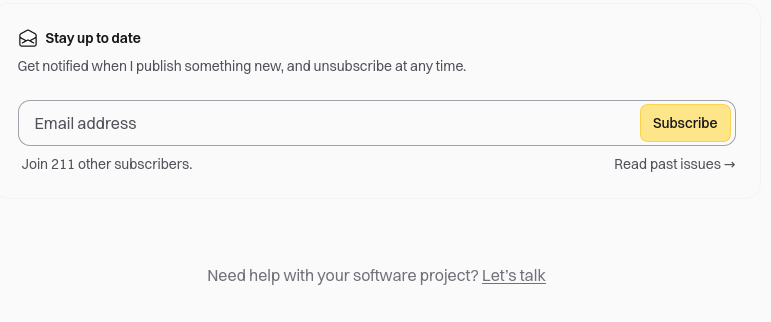

# Portfolio Development Guide

## Requirements
- The portfolio needs to be one page and open source.
- Build multilingual support [French, English].
- Admin of the portfolio can be in Angular [first admin with an API, implement admin panel afterward].
- Personalize mouse tracker.

## Inspirations and References

### General Design and Layout
- [Amir Dev](https://amirdev.nl/)
- [Cschad](https://cschad.com/)
- [Abdusamad](https://www.abdusamad.uz/)
- [Adam Alston](https://www.adamalston.com/)
- [Akash Pawara (Home Page)](https://akashpawara.com/)

### Specific Sections and Features
- [Akash Rajpurohit (Snippets Page)](https://akashrajpurohit.com/snippets/?ref=nav)
- [Akash Rajpurohit (Blog Page)](https://akashrajpurohit.com/blogs/?ref=nav)
- [Alejandro Gomez (Original)](https://alejandro-gomez.vercel.app/apps/loteria-monarca#challenge)
- [Adera Projects (Design)](https://www.a-dera.com/projects#)
- [Amruth Pillai (Design)](https://www.amruthpillai.com/) - GitHub Repo: [ResumeOnTheWeb](https://github.com/AmruthPillai/ResumeOnTheWeb)
- [Antoine D'Angleterre (Status of Availability)](https://www.antoinedangleterre.com/)
- [Ashish Mehra (Recent Work Section)](https://ashishmehra.dev/)
- [Aus Pham (Design Inspiration & Showcase Section)](https://auspham.dev/#projects) - GitHub Repo: [rockmanvnx6](https://github.com/rockmanvnx6)

### Additional Features and Inspiration
- [GitHub Profile Readme](https://github.com/rockmanvnx6/rockmanvnx6)
- [Marie Flor (Logo)](https://marieflor.dev/about)
- [Nico Bachner (Menu)](https://github.com/nico-bachner/v6)
- [CMDK Paco](https://cmdk.paco.me/)
- [Pawaret Dev (Sound When Changing Theme)](https://www.pawaret.dev/)
- [Thea Juniorise (Website Logo)](https://thea.juniorise.com/)
- [Chin Tristan (Landing Page Animation)](https://www.chintristan.io/) - GitHub Repo: [website-v6](https://github.com/maxijonson/website-v6)
- [Vivek Patel (Personalized Mouse Tracker)](https://www.vivek9patel.com/)
- [GitCoder (Contact Messages)](https://gitcoder.vercel.app/contact)
- [Yusuf Yildirim (Hire Me Message)](https://www.yusufyildirim.dev/)
- [Yashita Namdeo (Landing Page Animation)](https://yashitanamdeo.github.io/)

### github profile inspiration 
- [akash](https://github.com/akashpawara/akashpawara)
- [akash 2](https://github.com/AkashRajpurohit)

### i keep !!
- [amirdev](https://amirdev.nl/) :
    - emoji - using it for the landing page profil
    - As a challenge : build the whole page from scratch w/ tailwind, next js...
- [malikov](https://www.abdusamad.uz/) :
    - the ctrl + k command at the top roght of the page
    - ? the indication to use the command
    - articles page
    - ? very simple "contact me" page | why not ?
    - simple color palette
    - ? font | Biotif
    - simple nav bar, nothing is fixed.. the layout moves with the content
- [akashpawara](https://akashpawara.com/) : 
    - the "send me a signal" button on contact page
- [akashrajpurohit](https://akashrajpurohit.com/) : 
    - git running gif | https://raw.githubusercontent.com/AkashRajpurohit/AkashRajpurohit/master/assets/github-snake.svg
    - "work & hire me" section in about page
    - follow on platforms section
    - "list of honorable projects on github" section in projects page | the hover of the cards
    - snippets page | *
    - section at the bottom of every blog post | stay up to date - need help, let's talk ... 
    
-  [amruth](https://www.amruthpillai.com/) : 
    - naviguation bar on the left
    - logo at the top right & hover showing "Go to top" + the functionnality
    - menu button that disappear on hover to show the menu buttons
    - theme switch button
    - social links
    - ? the message ? | the effect that show a cursor like pre written text
    - work & education section
    - ? about me section
    - language section 
    - Resume section | ? use the resumeOnTheWeb project of auspham.. or build mine (opensource)
    - "star this project button on github" button
- [antonio_d](https://www.antoinedangleterre.com/) :
    - disponibility status
- [ashish](https://ashishmehra.dev/) : 
    - mockup for recent work images
- [auspham](https://auspham.dev/) : 
    - full page js
    - projects section | open source project pull directly from github (really ? live ? [here](https://chatgpt.com/share/03f5a945-f77d-49f5-9244-002e45a8e70a))
- [theo](https://thea.juniorise.com/) : 
    - site icon
- [christian](https://www.chintristan.io/) :
    - animation around the profile pic
- [vivek](https://www.vivek9patel.com/) : 
    - custom cursor | [npm animated cursor](https://www.npmjs.com/package/react-animated-)
    - resume visualisation page

### step by step guide 
# Step-by-Step Guide to Implement Features from Portfolio Inspirations

## 1. Landing Page (Home)
- **Emoji in Profile:** Use emojis in the landing page profile section to add personality.
- **Challenges Section:** Implement a section detailing personal challenges in building the website from scratch using Tailwind CSS and Next.js.

## 2. Navigation Bar
- **Left-aligned Nav Bar:** Create a left-aligned navigation bar for easy access.
- **Menu Button Animation:** Implement a menu button that disappears on hover to reveal menu options.

## 3. Theme Switch Button
- Add a theme switch button to toggle between light and dark modes.

## 4. Ctrl + K Command
- Implement a Ctrl + K command at the top right corner of the page for quick access to search functionality.

## 5. Articles Page
- Create a dedicated page for articles with a simple layout and navigation.

## 6. Contact Me Page
- Design a simple "Contact Me" page with prominent contact options.
- Include a "Send Me a Signal" button for a unique touch.

## 7. About Me Section
- Develop an "About Me" section with information about professional background and interests.

## 8. Work & Hire Me Section
- Design a section showcasing work and inviting potential employers to hire.

## 9. Follow on Platforms Section
- Include social media links for visitors to follow on different platforms.

## 10. List of Honorable Projects on GitHub
- Create a section displaying notable GitHub projects with hover effects.

## 11. Snippets Page
- Implement a page for code snippets or other useful resources.

## 12. Section at the Bottom of Every Blog Post
- Add a consistent section at the end of each blog post for staying updated and seeking help.

## 13. Mockup for Recent Work Images
- Design a mockup layout to showcase recent work images attractively.

## 14. Availability Status
- Include a status indicator to show availability for projects or collaborations.

## 15. Resume Visualization Page
- Create a page for visualizing the resume with interactive elements.

## 16. Site Icon
- Add a unique site icon for branding and recognition.

## 17. Animation Around Profile Pic
- Implement animation effects around the profile picture for visual appeal.

## 18. Custom Cursor
- Use a custom cursor with animation for an interactive experience.

## 19. Resume Section
- Develop a section to display the resume with downloadable options.

## 20. "Star This Project" Button on GitHub
- Include a button to star the project on GitHub for user engagement.

## 21. Full Page JavaScript
- Optimize the website with full-page JavaScript for enhanced functionality.

## 22. Open Source Project Section
- Integrate a section to showcase open-source projects directly from GitHub.

---

## References
- [amirdev](https://amirdev.nl/)
- [malikov](https://www.abdusamad.uz/)
- [akashpawara](https://akashpawara.com/)
- [akashrajpurohit](https://akashrajpurohit.com/)
- [amruth](https://www.amruthpillai.com/)
- [antonio_d](https://www.antoinedangleterre.com/)
- [ashish](https://ashishmehra.dev/)
- [auspham](https://auspham.dev/)
- [theo](https://thea.juniorise.com/)
- [christian](https://www.chintristan.io/)
- [vivek](https://www.vivek9patel.com/)

