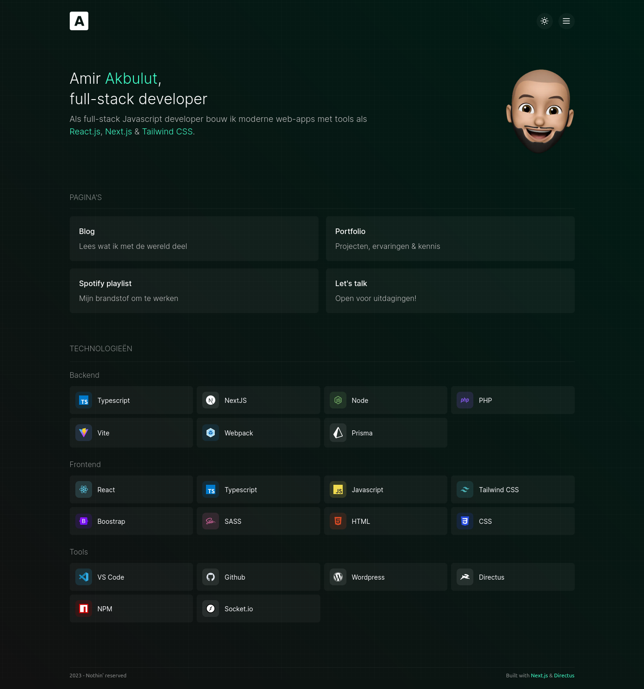
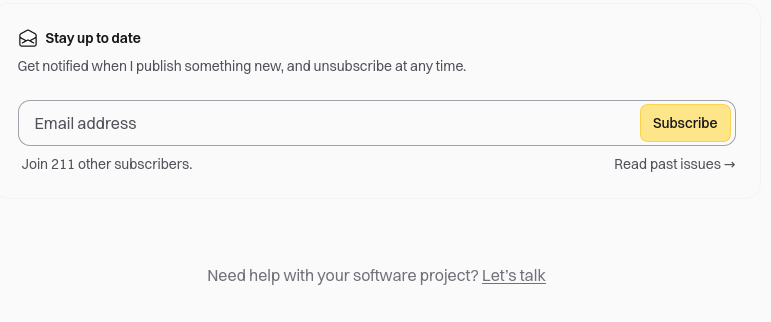
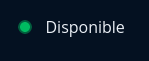
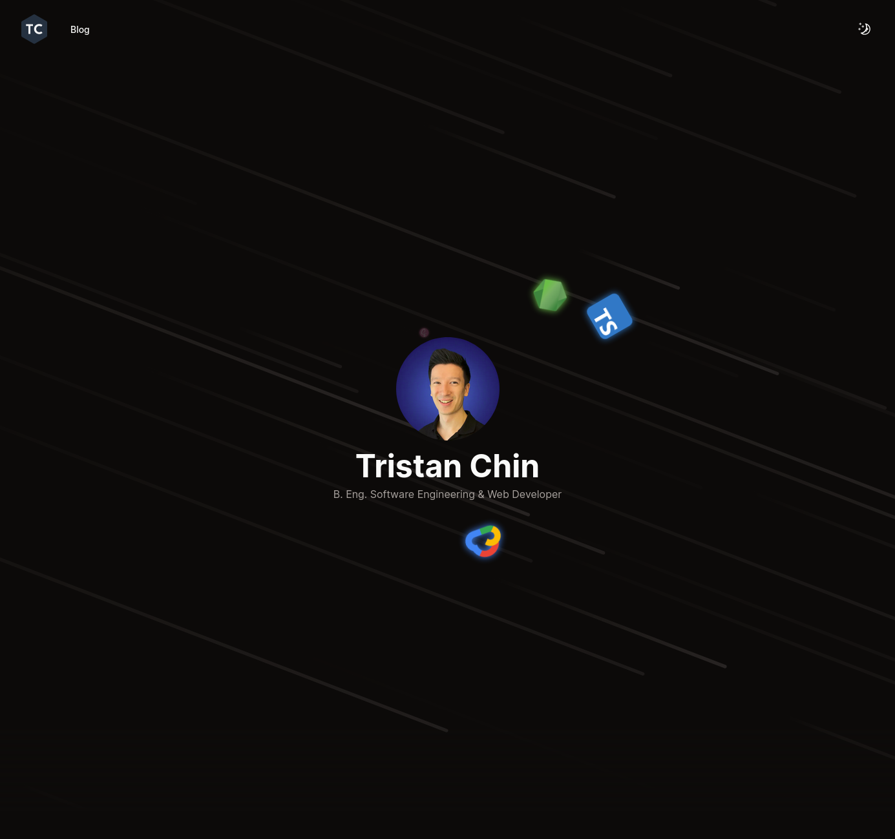
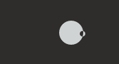
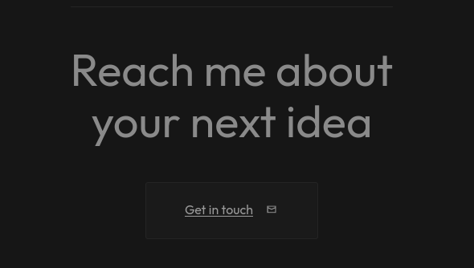

# Portfolio Development Guide

## Directives
- The portfolio needs to be one page and open source.
- Build multilingual support [French, English].
- Admin of the portfolio can be in Angular [first admin with an API, implement admin panel afterward].
- Personalize mouse tracker.

## Inspirations and References

### General Design and Layout
- [Amir Dev](https://amirdev.nl/)
- [Cschad](https://cschad.com/)
- [Abdusamad](https://www.abdusamad.uz/)
- [Adam Alston](https://www.adamalston.com/)
- [Akash Pawara (Home Page)](https://akashpawara.com/)

### Specific Sections and Features
- [Akash Rajpurohit (Snippets Page)](https://akashrajpurohit.com/snippets/?ref=nav)
- [Akash Rajpurohit (Blog Page)](https://akashrajpurohit.com/blogs/?ref=nav)
- [Alejandro Gomez (Original)](https://alejandro-gomez.vercel.app/apps/loteria-monarca#challenge)
- [Adera Projects (Design)](https://www.a-dera.com/projects#)
- [Amruth Pillai (Design)](https://www.amruthpillai.com/) - GitHub Repo: [ResumeOnTheWeb](https://github.com/AmruthPillai/ResumeOnTheWeb)
- [Antoine D'Angleterre (Status of Availability)](https://www.antoinedangleterre.com/)
- [Ashish Mehra (Recent Work Section)](https://ashishmehra.dev/)
- [Aus Pham (Design Inspiration & Showcase Section)](https://auspham.dev/#projects) - GitHub Repo: [rockmanvnx6](https://github.com/rockmanvnx6)

### Additional Features and Inspiration
- [GitHub Profile Readme](https://github.com/rockmanvnx6/rockmanvnx6)
- [Marie Flor (Logo)](https://marieflor.dev/about)
- [Nico Bachner (Menu)](https://github.com/nico-bachner/v6)
- [CMDK Paco](https://cmdk.paco.me/)
- [Pawaret Dev (Sound When Changing Theme)](https://www.pawaret.dev/)
- [Thea Juniorise (Website Logo)](https://thea.juniorise.com/)
- [Chin Tristan (Landing Page Animation)](https://www.chintristan.io/) - GitHub Repo: [website-v6](https://github.com/maxijonson/website-v6)
- [Vivek Patel (Personalized Mouse Tracker)](https://www.vivek9patel.com/)
- [GitCoder (Contact Messages)](https://gitcoder.vercel.app/contact)
- [Yusuf Yildirim (Hire Me Message)](https://www.yusufyildirim.dev/)
- [Yashita Namdeo (Landing Page Animation)](https://yashitanamdeo.github.io/)

### github profile inspiration 
- [akash](https://github.com/akashpawara/akashpawara)
- [akash 2](https://github.com/AkashRajpurohit)

### i keep !!
- [amirdev](https://amirdev.nl/) :
    - emoji - using it for the landing page profil |  
    - As a challenge : build the whole page from scratch w/ tailwind, next js... 
- [malikov](https://www.abdusamad.uz/) :
    - the ctrl + k command at the top right of the page
    - ? the indication to use the command
    - articles page
    - ? very simple "contact me" page | why not ?
    - simple color palette
    - ? font | Biotif
    - simple nav bar, nothing is fixed.. the layout moves with the content
- [akashpawara](https://akashpawara.com/) : 
    - the "send me a signal" button on contact page
- [akashrajpurohit](https://akashrajpurohit.com/) : 
    - git running gif | 
    - "work & hire me" section in about page
    - follow on platforms section
    - "list of honorable projects on github" section in projects page | the hover of the cards
    - snippets page | *
    - section at the bottom of every blog post | stay up to date - need help, let's talk ... 
    
-  [amruth](https://www.amruthpillai.com/) : 
    - naviguation bar on the left
    - logo at the top right & hover showing "Go to top" + the functionnality
    - menu button that disappear on hover to show the menu buttons
    - theme switch button
    - social links
    - ? the message ? | the effect that show a cursor like pre written text
    - work & education section
    - ? about me section
    - language section 
    - Resume section | ? use the resumeOnTheWeb project of auspham.. or build mine (opensource)
    - "star this project button on github" button
- [antonio_d](https://www.antoinedangleterre.com/) :
    - disponibility status | 
- [ashish](https://ashishmehra.dev/) : 
    - mockup for recent work images
- [auspham](https://auspham.dev/) : 
    - full page js
    - projects section | open source project pull directly from github (really ? live ? [here](https://chatgpt.com/share/03f5a945-f77d-49f5-9244-002e45a8e70a))
- [theo](https://thea.juniorise.com/) : 
    - favicon | ninja
- [christian](https://www.chintristan.io/) :
    - animation around the profile pic
    
- [vivek](https://www.vivek9patel.com/) : 
    - custom cursor | [npm animated cursor](https://www.npmjs.com/package/react-animated-) 
    
        
    - resume visualisation page
- [yusuf](https://www.yusufyildirim.dev/) :
    - i find this clean

    

